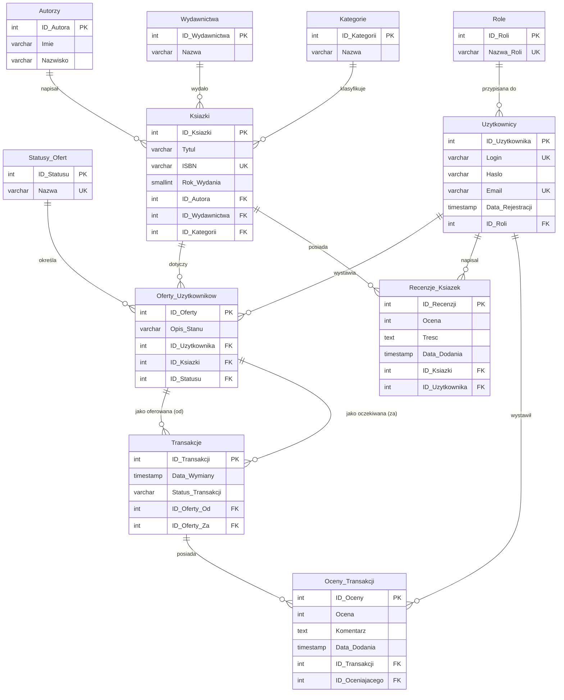

# Projekt: Platforma Wymiany Książek (System Barterowy)

## Skrypt Główny: `skrypt_glowny.sql`

Niniejszy dokument stanowi dokumentację techniczną bazy danych dla **Platformy Wymiany Książek** opartej na systemie barterowym. Baza danych została zaprojektowana i zaimplementowana w systemie **PostgreSQL** z wykorzystaniem języka proceduralnego **PL/pgSQL**.

---

## 1. Architektura Danych i Model Relacyjny (ERD)

Struktura bazy danych została znormalizowana do **Trzeciej Postaci Normalnej (3NF)** w celu wyeliminowania redundancji danych oraz zapewnienia spójności i integralności referencyjnej.



---

## 2. Specyfikacja Tabel (DDL)

Struktura tabel została zdefiniowana w skrypcie głównym z uwzględnieniem następujących poziomów zależności kluczy obcych:

### Poziom 0: Słowniki (Tabele niezależne)

1. **Role** – Przechowuje role użytkowników (np. `Admin`, `Uzytkownik`).
2. **Autorzy** – Katalog autorów książek (`Imie`, `Nazwisko`).
3. **Wydawnictwa** – Lista wydawnictw książkowych.
4. **Kategorie** – Kategorie literackie (np. Fantasy, Sci-Fi).
5. **Statusy_Ofert** – Statusy fizycznych egzemplarzy (np. `Dostępna`, `W trakcie wymiany`, `Wymieniona`).

### Poziom 1: Tabele bezpośrednio zależne

1. **Uzytkownicy** – Dane kont użytkowników. Posiada klucz obcy do tabeli `Role`. Adres e-mail oraz login muszą być unikalne.
2. **Ksiazki** – Centralny katalog tytułów książek. Posiada powiązania z autorami, wydawnictwami oraz kategoriami. Rok wydania ograniczony jest regułą `CHECK` do zakresu od 1000 do 2100.

### Poziom 2: Oferty użytkowników

1. **Oferty_Uzytkownikow** – Fizyczne egzemplarze książek wystawione przez użytkowników na wymianę, zawierające m.in. opis stanu technicznego i aktualny status oferty.

### Poziom 3: Relacje operacyjne i interakcje

1. **Transakcje** – Łączy dwie oferty w transakcję barterową (oferta przekazywana `ID_Oferty_Od` oraz oferta otrzymywana w zamian `ID_Oferty_Za`).
2. **Recenzje_Ksiazek** – Opinie i oceny (w skali 1-10) wystawiane konkretnym książkom przez użytkowników.

### Poziom 4: Oceny transakcji

1. **Oceny_Transakcji** – Oceny satysfakcji z wymiany (w skali 1-5) wraz z komentarzem tekstowym, powiązane z zakończoną transakcją.

---

## 3. Warstwa Abstrakcji Danych (Widoki)

W celu uproszczenia zapytań dla aplikacji klienckich oraz ukrycia złożonych relacji (złączeń `JOIN`), zaimplementowano następujące widoki (`VIEWS`):

| Nazwa Widoku | Cel i Funkcjonalność | Wykorzystane Tabele i Operacje |
| --- | --- | --- |
| **Ranking_Ksiazek** | Dynamicznie oblicza średnią ocenę oraz popularność (liczbę głosów) książek na podstawie opinii użytkowników. | `Ksiazki`, `Autorzy`, `Recenzje_Ksiazek` (`AVG`, `COUNT`, `GROUP BY`, `ORDER BY DESC`) |
| **v_Ksiazki_Szczegoly** | Prezentuje pełny zdenormalizowany katalog książek, zastępując cyfrowe identyfikatory czytelnymi dla użytkownika nazwami tekstowymi (np. złączenie imienia i nazwiska autora). | `Ksiazki`, `Autorzy`, `Wydawnictwa`, `Kategorie` (`JOIN`) |
| **v_Autorzy_Statystyki** | Wyświetla zestawienie wszystkich autorów oraz liczbę ich książek zarejestrowanych w systemie. | `Autorzy`, `Ksiazki` (`LEFT JOIN`, `COUNT`, `GROUP BY`) |
| **v_Kategorie_Statystyki** | Przedstawia statystyki popularności poszczególnych kategorii literackich na podstawie liczby woluminów. | `Kategorie`, `Ksiazki` (`LEFT JOIN`, `COUNT`, `GROUP BY`) |
| **Statystyki_Statusow_Ofert** | Służy do analizy operacyjnej, pokazując ile ofert posiada dany status (np. dostępna, wymieniona). | `Statusy_Ofert`, `Oferty_Uzytkownikow` (`LEFT JOIN`, `COUNT`, `GROUP BY`) |
| **Rejestr_Aktywnych_Transakcji** | Filtruje transakcje, które aktualnie są przetwarzane (status 'W toku'), ułatwiając ich monitoring. | `Transakcje` (`WHERE`, `ORDER BY ASC`) |
| **Widok_Zaangazowanie_Ofert** | Prezentuje stopień zaangażowania danej oferty w transakcjach (ile razy dany egzemplarz brał udział w próbach wymiany). | `Oferty_Uzytkownikow`, zagnieżdżone podzapytanie `COUNT` do `Transakcje` |
| **Widok_Pelne_Oferty** | Zbiera dane o ofercie: login wystawiającego, tytuł książki, stan fizyczny i status tekstowy. | `Oferty_Uzytkownikow`, `Uzytkownicy`, `Ksiazki`, `Statusy_Ofert` (`JOIN`) |
| **Widok_Pelne_Transakcje** | Zaawansowany widok łączący dane obu stron transakcji. Prezentuje kto wymienia się z kim oraz jakie książki biorą udział w procesie. | `Transakcje`, dwukrotne złączenia (`JOIN`) tabel `Oferty_Uzytkownikow`, `Uzytkownicy`, `Ksiazki` |
| **Widok_Oferty_W_Toku** | Wyodrębnia oferty zaangażowane w trwających transakcjach na podstawie operatora zbiorowego. | `Oferty_Uzytkownikow`, podzapytanie `IN` z operatorem `UNION` |
| **Widok_Najnowsza_Transakcja** | Zwraca dane o transakcji, która została zarejestrowana jako ostatnia w systemie. | `Transakcje` (`WHERE Data_Wymiany = (SELECT MAX...)`) |

---

## 4. Warstwa Logiki Biznesowej (Procedury i Wyzwalacze PL/pgSQL)

Integralność danych oraz reguły biznesowe systemu barterowego są zarządzane i wymuszane bezpośrednio w silniku bazy danych za pomocą **14 wyzwalaczy (`TRIGGERS`)** oraz **9 procedur składowanych (`STORED PROCEDURES`)**. Logika ta została podzielona modułowo według odpowiedzialności członków zespołu projektowego:

### 4.1. Wyzwalacze (Walidacja i Automatyzacja)

#### Moduł Martyny: Zarządzanie kontami użytkowników i uprawnieniami

1. **weryfikacja_email_przed_zapisem** (`BEFORE INSERT OR UPDATE ON Uzytkownicy`):
Weryfikuje, czy wprowadzany adres e-mail zawiera znak `@`. W przeciwnym razie przerywa operację błędem.
2. **ochrona_ostatniego_admina_w_bazie** (`BEFORE DELETE ON Uzytkownicy`):
Blokuje próbę usunięcia konta administratora, jeżeli w systemie ma pozostać tylko jedno takie konto. Gwarantuje dostęp administracyjny do systemu.
3. **ustawienie_domyslnej_roli_uzytkownik** (`BEFORE INSERT ON Uzytkownicy`):
Automatycznie przypisuje nowo rejestrowanemu użytkownikowi rolę `Uzytkownik`, jeśli rola nie została jawnie określona.
4. **ograniczenie_ilosci_adminow** (`BEFORE INSERT OR UPDATE ON Uzytkownicy`):
Polityka bezpieczeństwa ograniczająca liczbę aktywnych kont administratorów do maksymalnie 3 w całym systemie.

#### Moduł Agaty: Integralność katalogu książek

1. **trg_Ustaw_Rok** (`BEFORE INSERT ON Ksiazki`):
Ustawia rok wydania książki na bieżący rok kalendarzowy (pobierany z funkcji systemowych), jeżeli wartość ta nie została podana.
2. **trg_Blokuj_Usuniecie_Autora** (`BEFORE DELETE ON Autorzy`):
Blokuje usunięcie autora z bazy, jeśli w tabeli `Ksiazki` znajdują się przypisane do niego pozycje (zapobiega powstawaniu tzw. "osieroconych rekordów").
3. **trg_Upper_Tytul** (`BEFORE INSERT ON Ksiazki`):
Wymusza formatowanie tytułów książek do wielkich liter (`UPPER`), ujednolicając dane w katalogu.

#### Moduł Damiana: Logika transakcji i ofert barterowych

1. **trg_po_dodaniu_transakcji** (`AFTER INSERT ON Transakcje`):
Automatyzacja workflow: po zarejestrowaniu transakcji wyszukuje zaangażowane w nią oferty i zmienia ich status w tabeli `Oferty_Uzytkownikow` na "Wymieniona".
2. **trg_walidacja_id_ofert** (`BEFORE INSERT OR UPDATE ON Transakcje`):
Weryfikacja poprawności logicznej: blokuje transakcje, w których użytkownik próbuje wymienić ofertę na tę samą ofertę (`ID_Oferty_Od` równe `ID_Oferty_Za`).
3. **trg_blokada_rezerwacji** (`BEFORE INSERT ON Transakcje`):
Zapobiega konfliktom współbieżnym (anomalia *Double-booking*). Blokuje utworzenie transakcji, jeśli któraś z ofert bierze już udział w innej aktywnej transakcji o statusie "W toku".
4. **trg_blokada_usuniecia_transakcji** (`BEFORE DELETE ON Transakcje`):
Blokuje możliwość usunięcia z bazy transakcji archiwalnych, które zostały pomyślnie "Zrealizowane".
5. **trg_zablokuj_duplikaty_ofert** (`BEFORE INSERT ON Oferty_Uzytkownikow`):
Zapobiega spamingowi. Użytkownik nie może wystawić nowej oferty dla danej książki, jeśli ma już aktywną (niewymienioną) ofertę na ten sam tytuł.

#### Moduł Kacpra: Reputacja i interakcje społecznościowe

1. **TRG_Zablokuj_Przedwczesna_Ocene** (`BEFORE INSERT ON Oceny_Transakcji`):
Blokuje wystawienie oceny dla wymiany, jeśli jej status w tabeli transakcji jest inny niż "Zrealizowana" lub "Zakończona".
2. **TRG_Blokuj_Podwojna_Recenzje** (`BEFORE INSERT ON Recenzje_Ksiazek`):
Ogranicza aktywność użytkowników, pozwalając na napisanie tylko jednej recenzji do konkretnej książki.

---

### 4.2. Procedury Składowane (API Bazy Danych)

W celu hermetyzacji (enkapsulacji) logiki biznesowej i ułatwienia integracji z aplikacją backendową, w systemie zdefiniowano interfejs API w postaci procedur:

* **`proc_Dodaj_Autora_i_Ksiazke`**:
Rejestruje nowego autora, pobiera wygenerowane dla niego `ID` i natychmiast przypisuje go do wstawianej w tym samym kroku książki. Całość zabezpieczona jest obsługą błędów (instrukcja `ROLLBACK`).
* **`proc_Dodaj_Recenzje`**:
Bezpieczny punkt zapisu dla wystawiania opinii książkom.
* **`proc_Dodaj_Oferte`**:
Umożliwia dodanie fizycznej oferty za pomocą przyjaznych parametrów tekstowych: loginu użytkownika i tytułu książki (procedura sama wyszukuje powiązane klucze `ID_Uzytkownika` i `ID_Ksiazki` oraz ustawia domyślny status "Dostępna").
* **`proc_Zmien_Status_Oferty`**:
Modyfikuje status fizycznego egzemplarza (np. ręczne wycofanie oferty).
* **`proc_Dodaj_Uzytkownika`**:
Procedura rejestracji konta użytkownika.
* **`proc_Usun_Recenzje`**:
Pozwala na usunięcie recenzji (np. przez administratora).
* **`proc_Utworz_Transakcje`**:
Służy do szybkiego utworzenia transakcji wymiany z domyślnym statusem "W toku".
* **`proc_Dodaj_Transakcje`**:
Zaawansowane dodawanie transakcji zawierające pełną walidację istnienia obu ofert w systemie oraz wychwytywanie i logowanie wyjątków.
* **`proc_Zmien_Role_Uzytkownika`**:
Pozwala na awansowanie lub degradację ról kont użytkowników w systemie.

---

## 5. Polityka Bezpieczeństwa (DCL)

Dostęp do struktur danych został ściśle zdefiniowany w oparciu o architekturę **RBAC (Role-Based Access Control)** w skrypcie głównym:

1. **Rola `Aplikacja_Konto**`:

* Dedykowana dla serwera backendowego (API połączeniowego).
* Posiada uprawnienia `SELECT`, `INSERT`, `UPDATE` na tabelach i sekwencjach w schemacie publicznym.
* **Zabezpieczenie przed utratą danych**: Odebrano roli aplikacyjnej możliwość fizycznego usuwania wierszy za pomocą instrukcji `REVOKE DELETE ON ALL TABLES`. Zapobiega to atakom typu SQL Injection, które mogłyby doprowadzić do wyczyszczenia bazy danych. Wszelkie usunięcia realizowane są w logice aplikacji poprzez zmianę statusu (tzw. *Soft Delete*).

1. **Rola `Administrator_Konto**`:

* Dedykowana do celów serwisowych, konserwacyjnych i archiwizacji.
* Posiada pełne uprawnienia (`ALL PRIVILEGES`) na wszystkich obiektach bazy danych.

---

## 6. Integralność Transakcyjna (ACID)

W architekturze barterowej kluczową kwestią jest unikanie konfliktów dostępu współbieżnego (zjawisko *Double-booking*), czyli sytuacji, gdy dany egzemplarz książki zostanie zarezerwowany w dwóch różnych transakcjach jednocześnie.

Aby temu zapobiec, operacja inicjowania transakcji wymiany realizowana jest z użyciem najwyższego poziomu izolacji transakcji w standardzie SQL – **`SERIALIZABLE`** w korelacji z wyzwalaczem blokującym `trg_blokada_rezerwacji`:

```sql
BEGIN;
SET TRANSACTION ISOLATION LEVEL SERIALIZABLE;

-- Próba dodania transakcji wymiany barterowej
INSERT INTO Transakcje (Status_Transakcji, ID_Oferty_Od, ID_Oferty_Za)
VALUES ('W toku', 9, 10);

COMMIT;

```

Dzięki poziomowi `SERIALIZABLE` silnik PostgreSQL traktuje transakcje tak, jakby były wykonywane sekwencyjnie. Jeśli w tym samym momencie inny proces spróbuje przypisać ofertę 9 lub 10 do innej wymiany, system automatycznie odrzuci jedną z transakcji (błąd współbieżności serializacji), zapobiegając anomaliom *Phantom Reads* i *Non-Repeatable Reads*.
